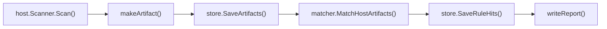
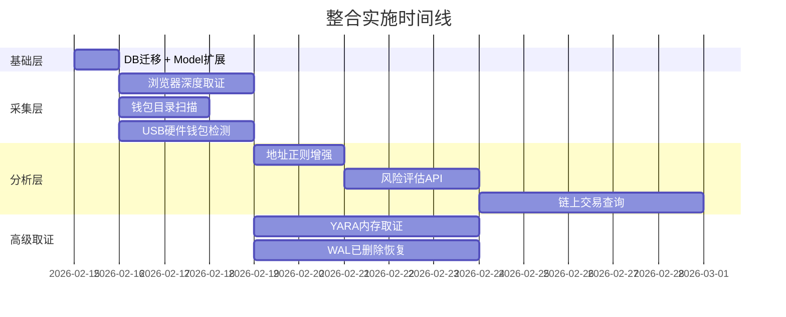

# 开源项目精准整合实施方案 — 对齐现有代码架构

> 本文档基于对 `crypto-inspector` 全部 51 个 Go 源文件的深度审查，将每项开源整合精确映射到现有的**文件路径、函数签名、数据结构、DB表/字段**，给出逐步操作指引。

---

## 核心架构理解

当前代码流程固定为以下管道，所有新模块**必须**遵循此模式：



**关键约束**：
- `artifacts.artifact_type` 受 DB CHECK 约束，新增类型需要写迁移脚本（参考 003/004）
- `rule_hits.hit_type` 同理受 CHECK 约束
- `host.Scanner.Scan()` 通过 `scanWindows()` / `scanMacOS()` 分发，新采集项需在两处都添加
- `matcher.MatchHostArtifacts()` 通过 `decodeArtifacts()` 反序列化后分别处理

---

## 整合项 1：浏览器深度取证（Cookie / 下载 / 书签）

### 当前代码现状

| 文件 | 函数 | 当前能力 |
|------|------|----------|
| [scanner.go](file:///Users/xinghe/XingheAI2026/数字币/internal/adapters/host/scanner.go#L83-L127) | `scanWindows()` | 调用 `collectWindowsInstalledApps` + `collectWindowsExtensions` + `collectWindowsHistory` |
| [scanner.go](file:///Users/xinghe/XingheAI2026/数字币/internal/adapters/host/scanner.go#L129-L173) | `scanMacOS()` | 调用 `collectMacInstalledApps` + `collectMacExtensions` + `collectMacHistory` |
| [scanner.go](file:///Users/xinghe/XingheAI2026/数字币/internal/adapters/host/scanner.go#L1012-L1051) | `collectChromiumHistory()` | 只查 `urls JOIN visits` 的 URL/标题/时间 |
| [scanner.go](file:///Users/xinghe/XingheAI2026/数字币/internal/adapters/host/scanner.go#L1133-L1198) | `querySQLite()` | **已有** WAL 安全复制+查询机制（可复用） |
| [scan.go](file:///Users/xinghe/XingheAI2026/数字币/internal/domain/model/scan.go#L27-L44) | `ArtifactType` 常量 | 目前 7 种，无 Cookie/Download/Bookmark |
| [001_init.sql](file:///Users/xinghe/XingheAI2026/数字币/internal/adapters/store/sqlite/migrations/001_init.sql#L55-L63) | `artifact_type CHECK` | 已通过 003/004 扩展了枚举列表 |

### 需要引入的开源库

| 库 | 用途 | 许可证 |
|----|------|--------|
| `github.com/ArcticDev78/go-chrome-cookies` | 解密 Chrome/Edge/Firefox 的 Cookie、密码、书签、下载、自动填充 | MIT |
| `github.com/browserutils/kooky` | 跨浏览器 Cookie 读取 + 自动定位 Cookie 文件 | MIT |

### 细化步骤

#### 步骤 1.1：新增 ArtifactType 常量

修改 [scan.go](file:///Users/xinghe/XingheAI2026/数字币/internal/domain/model/scan.go)：

```diff
 const (
     ArtifactInstalledApps    ArtifactType = "installed_apps"
     ArtifactBrowserExt       ArtifactType = "browser_extension"
     ArtifactBrowserHistory   ArtifactType = "browser_history"
     ArtifactBrowserHistoryDB ArtifactType = "browser_history_db"
+    ArtifactBrowserCookie    ArtifactType = "browser_cookie"
+    ArtifactBrowserDownload  ArtifactType = "browser_download"
+    ArtifactBrowserBookmark  ArtifactType = "browser_bookmark"
     ArtifactMobilePackages   ArtifactType = "mobile_packages"
 )
```

#### 步骤 1.2：新增对应 Record 结构

在 [scan.go](file:///Users/xinghe/XingheAI2026/数字币/internal/domain/model/scan.go) 文件末尾添加：

```go
// CookieRecord 浏览器 Cookie 采集后的统一结构
type CookieRecord struct {
    Browser   string `json:"browser"`
    Profile   string `json:"profile,omitempty"`
    Domain    string `json:"domain"`
    Name      string `json:"name"`
    Path      string `json:"path"`
    Value     string `json:"value,omitempty"`  // 脱敏后的值或摘要
    ExpiresAt int64  `json:"expires_at"`
    IsSecure  bool   `json:"is_secure"`
    IsHTTPO   bool   `json:"is_httponly"`
}

// DownloadRecord 浏览器下载记录
type DownloadRecord struct {
    Browser      string `json:"browser"`
    Profile      string `json:"profile,omitempty"`
    URL          string `json:"url"`
    Filename     string `json:"filename"`
    MimeType     string `json:"mime_type,omitempty"`
    TotalBytes   int64  `json:"total_bytes"`
    StartTime    int64  `json:"start_time"`
    EndTime      int64  `json:"end_time,omitempty"`
    SavePath     string `json:"save_path,omitempty"`
}

// BookmarkRecord 浏览器书签
type BookmarkRecord struct {
    Browser   string `json:"browser"`
    Profile   string `json:"profile,omitempty"`
    Title     string `json:"title"`
    URL       string `json:"url"`
    Domain    string `json:"domain"`
    Folder    string `json:"folder,omitempty"`
    CreatedAt int64  `json:"created_at"`
}
```

#### 步骤 1.3：DB 迁移脚本

新增 [005_browser_deep_artifacts.sql](file:///Users/xinghe/XingheAI2026/数字币/internal/adapters/store/sqlite/migrations/005_browser_deep_artifacts.sql)：

- 重建 `artifacts` 表，在 CHECK 约束中添加 `'browser_cookie'`, `'browser_download'`, `'browser_bookmark'`
- 同理重建 `rule_hits` 表如需新增 `hit_type`（此阶段暂不需要，Cookie 命中复用 `exchange_visited`）

#### 步骤 1.4：新增采集函数

新建 [browser_deep.go](file:///Users/xinghe/XingheAI2026/数字币/internal/adapters/host/browser_deep.go)：

```go
package host

import "github.com/ArcticDev78/go-chrome-cookies/browser"

// collectChromiumCookies 解密 Chromium 浏览器 Cookie
// 入参：profileRoot 使用现有 chromiumHistoryDBSpecs() 发现的路径
// 输出：[]model.CookieRecord
func collectChromiumCookies(ctx context.Context, profileRoot, browser string) []model.CookieRecord { ... }

// collectChromiumDownloads 从 History SQLite 的 downloads 表提取
// 复用已有的 querySQLite() 函数（scanner.go:1133）
func collectChromiumDownloads(ctx context.Context, profileRoot, browser string) []model.DownloadRecord { ... }

// collectChromiumBookmarks 读取 Bookmarks JSON 文件（不需 SQLite）
func collectChromiumBookmarks(profileRoot, browser string) []model.BookmarkRecord { ... }
```

#### 步骤 1.5：在 scanWindows/scanMacOS 中引用新函数

修改 [scanner.go](file:///Users/xinghe/XingheAI2026/数字币/internal/adapters/host/scanner.go) 的 `scanWindows()` (L83) 和 `scanMacOS()` (L129)：

```diff
 func (s *Scanner) scanWindows(...) {
     // 现有三步 ...
+    // 步骤 4: 浏览器 Cookie
+    cookies := collectWindowsCookies(ctx)
+    if len(cookies) > 0 {
+        a, _ := s.makeArtifact(caseID, device.ID, model.ArtifactBrowserCookie, ...)
+        arts = append(arts, a)
+    }
+    // 步骤 5: 浏览器下载记录
+    downloads := collectWindowsDownloads(ctx)
+    ...
+    // 步骤 6: 书签
+    bookmarks := collectWindowsBookmarks()
+    ...
 }
```

#### 步骤 1.6：在 matcher 中扩展 decodeArtifacts

修改 [host_matcher.go](file:///Users/xinghe/XingheAI2026/数字币/internal/services/matcher/host_matcher.go) 的 `decodeArtifacts()` (L235)：

```diff
 func decodeArtifacts(artifacts []model.Artifact) (...) {
     for _, a := range artifacts {
         switch a.Type {
         case model.ArtifactInstalledApps: ...
         case model.ArtifactBrowserExt: ...
         case model.ArtifactBrowserHistory: ...
+        case model.ArtifactBrowserCookie:
+            var recs []model.CookieRecord
+            _ = json.Unmarshal(a.PayloadJSON, &recs)
+            cookies = append(cookies, recs...)
+        case model.ArtifactBrowserDownload:
+            var recs []model.DownloadRecord
+            _ = json.Unmarshal(a.PayloadJSON, &recs)
+            downloads = append(downloads, recs...)
         }
     }
 }
```

#### 步骤 1.7：新增 Cookie/下载匹配逻辑

在 `matchExchanges()` (L378) 中增加 Cookie 域名匹配，与 visits 使用相同的 `normalizeDomain()` + 规则比对逻辑。下载记录匹配钱包安装文件名模式。

**预计工作量：3-5 天**

---

## 整合项 2：加密地址全文扫描增强

### 当前代码现状

| 文件 | 函数/变量 | 现状 |
|------|----------|------|
| [host_matcher.go](file:///Users/xinghe/XingheAI2026/数字币/internal/services/matcher/host_matcher.go#L52-L59) | `reEVMAddress`, `reBTCBech32`, `reBTCBase58` | **已有** 3 种正则 |
| [host_matcher.go](file:///Users/xinghe/XingheAI2026/数字币/internal/services/matcher/host_matcher.go#L61-L200) | `matchWalletAddresses()` | **已有** 完整的地址抽取逻辑（从 VisitRecord URL/Title 中提取） |
| [host_matcher_test.go](file:///Users/xinghe/XingheAI2026/数字币/internal/services/matcher/host_matcher_test.go) | 测试 | **已有** 测试覆盖 EVM/bech32/base58 |

### 差距

- 缺少 TRX (T开头 base58) 和 SOL (base58-32-44字符) 正则
- 只从 `VisitRecord.URL` 和 `VisitRecord.Title` 中提取，缺少对 Cookie/下载/书签中的地址提取
- 无校验码验证（可能有误报）

### 细化步骤

#### 步骤 2.1：扩展正则集合

修改 [host_matcher.go](file:///Users/xinghe/XingheAI2026/数字币/internal/services/matcher/host_matcher.go#L52-L59)：

```diff
 var (
     reEVMAddress = regexp.MustCompile(`(?i)0x[0-9a-f]{40}`)
     reBTCBech32  = regexp.MustCompile(`(?i)bc1[ac-hj-np-z02-9]{25,87}`)
     reBTCBase58  = regexp.MustCompile(`[13][1-9A-HJ-NP-Za-km-z]{25,34}`)
+    reTRXAddress = regexp.MustCompile(`T[A-Za-z1-9]{33}`)          // TRON base58
+    reBTCTaproot = regexp.MustCompile(`bc1p[a-zA-Z0-9]{38,58}`)   // Taproot
 )
```

> **注意**：SOL 地址（32-44 字符 base58）与 BTC base58 有大量重叠，暂不推荐自动提取 SOL，避免误报率过高。

#### 步骤 2.2：在 matchWalletAddresses 中添加 TRX 匹配

在 [host_matcher.go](file:///Users/xinghe/XingheAI2026/数字币/internal/services/matcher/host_matcher.go) 的 `matchWalletAddresses()` 函数中，仿照现有 EVM/BTC 处理模式添加 TRX：

```go
// TRX 地址提取（在 matchWalletAddresses() 内部 for v := range visits 循环中）
trxMatches := reTRXAddress.FindAllString(v.URL, -1)
trxMatches = append(trxMatches, reTRXAddress.FindAllString(v.Title, -1)...)
for _, addr := range trxMatches {
    key := hitKey("wallet_address", "trx", addr)
    addOrUpdateHit(agg, key, model.RuleHit{
        // ... 同现有 EVM 处理模式
        MatchedValue: addr,
    })
}
```

#### 步骤 2.3：引入校验码验证库

在 `go.mod` 中添加：
```
github.com/ethereum/go-ethereum v1.14.x   // common.IsHexAddress()
github.com/btcsuite/btcd v0.24.x          // btcutil.DecodeAddress()
```

在 `matchWalletAddresses()` 中抽取到地址后，调用校验函数过滤误报：

```go
import "github.com/ethereum/go-ethereum/common"

// 校验 EVM 地址格式
if !common.IsHexAddress(addr) { continue }
```

#### 步骤 2.4：扩展测试

在 [host_matcher_test.go](file:///Users/xinghe/XingheAI2026/数字币/internal/services/matcher/host_matcher_test.go) 中新增 TRX 地址测试用例。

**预计工作量：2 天**

---

## 整合项 3：地址风险评估 API

### 当前代码现状

| 文件 | 对应位置 | 现状 |
|------|----------|------|
| [chain.go](file:///Users/xinghe/XingheAI2026/数字币/internal/services/webapp/chain.go) | webapp chain API | 已有 `/api/chain/eth/balance` 等余额查询端点 |
| [provider.go](file:///Users/xinghe/XingheAI2026/数字币/internal/services/chainbalance/provider.go) | `Provider` 接口 | 定义了 `QueryBalances()` 方法 |
| [scan.go](file:///Users/xinghe/XingheAI2026/数字币/internal/domain/model/scan.go#L76-L80) | `HitType` | 有 `wallet_address` 和 `token_balance`，无 `risk_score` |

### 新增模块结构

```
internal/
  adapters/
    intel/                  ← 新建目录
      chainabuse.go         ← Chainabuse API 客户端
      failsafe.go           ← FailSafe Radar API 客户端
      scorechain.go         ← Scorechain 制裁名单查询
      provider.go           ← 聚合接口定义
  services/
    webapp/
      intel_api.go          ← 新增 /api/intel/* 端点
```

### 细化步骤

#### 步骤 3.1：定义 Provider 接口

新建 [provider.go](file:///Users/xinghe/XingheAI2026/数字币/internal/adapters/intel/provider.go)：

```go
package intel

type RiskReport struct {
    Address      string   `json:"address"`
    Chain        string   `json:"chain"`
    ReportCount  int      `json:"report_count"`
    RiskScore    int      `json:"risk_score"`     // 0-100
    Categories   []string `json:"categories"`     // "scam","ransomware","mixer"
    IsSanctioned bool     `json:"is_sanctioned"`
    Sources      []string `json:"sources"`
}

type Provider interface {
    CheckAddress(ctx context.Context, chain, address string) (*RiskReport, error)
}
```

#### 步骤 3.2：实现 Chainabuse 客户端

新建 [chainabuse.go](file:///Users/xinghe/XingheAI2026/数字币/internal/adapters/intel/chainabuse.go)：

- 参考现有 [btc.go](file:///Users/xinghe/XingheAI2026/数字币/internal/services/chainbalance/btc.go) 的 HTTP 客户端模式（`http.Get` + JSON 解码）
- 无需 API key，直接 GET 请求

#### 步骤 3.3：新增 HitType

修改 [scan.go](file:///Users/xinghe/XingheAI2026/数字币/internal/domain/model/scan.go)：

```diff
 const (
     HitWalletInstalled HitType = "wallet_installed"
     HitExchangeVisited HitType = "exchange_visited"
     HitWalletAddress   HitType = "wallet_address"
     HitTokenBalance    HitType = "token_balance"
+    HitAddressRisk     HitType = "address_risk"
 )
```

需要配套 DB 迁移来更新 `rule_hits.hit_type` 的 CHECK 约束。

#### 步骤 3.4：新增 API 端点

新建 [intel_api.go](file:///Users/xinghe/XingheAI2026/数字币/internal/services/webapp/intel_api.go)：

```go
// GET /api/intel/risk?address=XXX&chain=eth
func (s *Server) handleIntelRisk(w http.ResponseWriter, r *http.Request) { ... }
```

在 [webapp.go](file:///Users/xinghe/XingheAI2026/数字币/internal/services/webapp/webapp.go) 的 `Server` struct 中增加 `intel *intel.AggregatedProvider` 字段，在 `Run()` 中初始化。

修改 `registerRoutes()` 注册新路由。

**预计工作量：3 天**

---

## 整合项 4：链上交易历史查询

### 当前代码现状

| 文件 | 接口 | 现状 |
|------|------|------|
| [provider.go](file:///Users/xinghe/XingheAI2026/数字币/internal/services/chainbalance/provider.go) | `Provider.QueryBalances()` | 只有余额查询，无交易历史 |
| [chain.go](file:///Users/xinghe/XingheAI2026/数字币/internal/services/webapp/chain.go) | webapp chain API | 只有 `/api/chain/eth/balance` 等 |
| [evm.go](file:///Users/xinghe/XingheAI2026/数字币/internal/services/chainbalance/evm.go) | `EVMProvider` | 使用 JSON-RPC `eth_getBalance`，可扩展 |

### 新增模块结构

```
internal/
  services/
    chaintx/                ← 新建目录（与 chainbalance 平行）
      provider.go           ← TxProvider 接口
      etherscan.go          ← Etherscan API 实现
      blockstream.go        ← BTC (Blockstream) 实现 
      tronscan.go           ← TRX (Tronscan) 实现
```

### 细化步骤

#### 步骤 4.1：定义 TxProvider 接口

```go
package chaintx

type TxRecord struct {
    Hash      string `json:"hash"`
    From      string `json:"from"`
    To        string `json:"to"`
    Value     string `json:"value"`
    Timestamp int64  `json:"timestamp"`
    Chain     string `json:"chain"`
    BlockNum  int64  `json:"block_number"`
    IsError   bool   `json:"is_error"`
}

type TxProvider interface {
    GetTxList(ctx context.Context, address string, limit int) ([]TxRecord, error)
}
```

#### 步骤 4.2：实现 Etherscan API

参考现有 [evm.go](file:///Users/xinghe/XingheAI2026/数字币/internal/services/chainbalance/evm.go) 的 HTTP 模式：

```go
// GET https://api.etherscan.io/api?module=account&action=txlist&address=XXX&sort=desc&apikey=YYY
func (p *EtherscanProvider) GetTxList(ctx context.Context, address string, limit int) ([]TxRecord, error) {
    // 免费 API key，5 req/sec
}
```

#### 步骤 4.3：实现 Blockstream BTC API

参考现有 [btc.go](file:///Users/xinghe/XingheAI2026/数字币/internal/services/chainbalance/btc.go)（已经使用 Blockstream API）：

```go
// GET https://blockstream.info/api/address/XXX/txs
func (p *BlockstreamTxProvider) GetTxList(ctx context.Context, address string, limit int) ([]TxRecord, error) { ... }
```

#### 步骤 4.4：新增 API 端点 + 图谱数据

```go
// webapp/chain_tx_api.go
// GET  /api/chain/eth/txlist?address=XXX
// GET  /api/chain/btc/txlist?address=XXX
// GET  /api/chain/tx-graph?address=XXX&depth=2  → Cytoscape.js 格式
```

#### 步骤 4.5：前端集成 Cytoscape.js

修改 [ui_dist/index.html](file:///Users/xinghe/XingheAI2026/数字币/internal/services/webapp/ui_dist/index.html) 引入 CDN 库，新增图谱交互页面。

**预计工作量：5 天后端 + 5 天前端**

---

## 整合项 5：USB/硬件钱包连接检测

### 当前代码接入点

新采集项接入方式与已有 `collectMacInstalledApps()` / `collectWindowsInstalledApps()` 完全一致。

### 新增文件结构

```
internal/
  adapters/
    host/
      usb_scanner.go         ← 新建
      usb_scanner_darwin.go   ← macOS 实现
      usb_scanner_windows.go  ← Windows 实现
```

### 细化步骤

#### 步骤 5.1：新增 ArtifactType 和 Record

在 [scan.go](file:///Users/xinghe/XingheAI2026/数字币/internal/domain/model/scan.go) 中：

```diff
+    ArtifactUSBHistory ArtifactType = "usb_device_history"
```

```go
type USBDeviceRecord struct {
    VendorID    string `json:"vendor_id"`
    ProductID   string `json:"product_id"`
    VendorName  string `json:"vendor_name,omitempty"`
    ProductName string `json:"product_name,omitempty"`
    Serial      string `json:"serial,omitempty"`
    IsWallet    bool   `json:"is_wallet"`
    WalletName  string `json:"wallet_name,omitempty"`
    FirstSeen   int64  `json:"first_seen,omitempty"`
    LastSeen    int64  `json:"last_seen,omitempty"`
}
```

#### 步骤 5.2：macOS 实现

[usb_scanner_darwin.go](file:///Users/xinghe/XingheAI2026/数字币/internal/adapters/host/usb_scanner_darwin.go)：

```go
// 使用 log show --predicate 'subsystem == "com.apple.usbd"'
// 参考现有 collectMacInstalledApps() 的 exec.Command 模式 (scanner.go:550)
func collectMacUSBHistory(ctx context.Context) ([]model.USBDeviceRecord, error) {
    cmd := exec.CommandContext(ctx, "log", "show",
        "--predicate", `subsystem == "com.apple.usbd"`,
        "--last", "90d", "--style", "ndjson")
    // ... 解析日志，匹配 VendorID 2c97(Ledger)/534c(Trezor)/2b24(KeepKey)
}
```

#### 步骤 5.3：在 scanMacOS/scanWindows 中添加调用

修改 [scanner.go](file:///Users/xinghe/XingheAI2026/数字币/internal/adapters/host/scanner.go) 的 `scanMacOS()` (L129)：

```diff
 func (s *Scanner) scanMacOS(...) {
     // 现有三步 ...
+    // 步骤 4: USB 硬件钱包连接历史
+    usbDevices, usbErr := collectMacUSBHistory(ctx)
+    if len(usbDevices) > 0 {
+        a, _ := s.makeArtifact(caseID, device.ID, model.ArtifactUSBHistory, ...)
+        arts = append(arts, a)
+    }
 }
```

#### 步骤 5.4：在 matcher 中添加 USB 命中

USB 设备如果匹配已知钱包 VendorID，生成 `HitWalletInstalled` 命中（复用现有类型，detail 标明来源为 USB）。

**预计工作量：3 天**

---

## 整合项 6：钱包数据目录扫描

### 当前代码接入点

当前通过 `collectMacInstalledApps()` (L550) 扫描 `/Applications` 目录匹配 .app。可以增加一个类似函数扫描钱包数据目录。

### 细化步骤

#### 步骤 6.1：新增 ArtifactType

```diff
+    ArtifactWalletDataDir ArtifactType = "wallet_data_dir"
```

```go
type WalletDataDirRecord struct {
    WalletName    string `json:"wallet_name"`
    Path          string `json:"path"`
    Exists        bool   `json:"exists"`
    SizeBytes     int64  `json:"size_bytes"`
    LastModified  int64  `json:"last_modified"`
    KeyFiles      []string `json:"key_files,omitempty"` // 发现的关键文件
}
```

#### 步骤 6.2：新建采集函数

新建 [wallet_dirs.go](file:///Users/xinghe/XingheAI2026/数字币/internal/adapters/host/wallet_dirs.go)：

```go
// 已知钱包数据目录（可从 wallet_signatures.yaml 中扩展）
var walletDataPaths = map[string][]string{
    "Bitcoin Core":   {"~/.bitcoin/", "~/Library/Application Support/Bitcoin/"},
    "Ethereum Geth":  {"~/.ethereum/", "~/Library/Ethereum/"},
    "Ledger Live":    {"~/Library/Application Support/Ledger Live/"},
    "Trezor Suite":   {"~/Library/Application Support/@trezor/suite-desktop/"},
    "Exodus":         {"~/Library/Application Support/Exodus/"},
    "Electrum":       {"~/.electrum/", "~/Library/Application Support/Electrum/"},
}

func collectWalletDataDirs() ([]model.WalletDataDirRecord, error) { ... }
```

#### 步骤 6.3：可选——在规则 YAML 中扩展

修改 [rules.go](file:///Users/xinghe/XingheAI2026/数字币/internal/domain/model/rules.go) 的 `WalletDesktopHints`：

```diff
 type WalletDesktopHints struct {
     AppKeywords         []string `yaml:"app_keywords"`
     FileKeywords        []string `yaml:"file_keywords"`
     InstallPathsWindows []string `yaml:"install_paths_windows"`
     InstallPathsMacOS   []string `yaml:"install_paths_macos"`
+    DataDirsWindows     []string `yaml:"data_dirs_windows,omitempty"`
+    DataDirsMacOS       []string `yaml:"data_dirs_macos,omitempty"`
 }
```

这样钱包数据目录路径可以通过规则文件热更新，无需重新编译。

**预计工作量：2 天**

---

## 整合项 7：YARA 内存取证

### 外部依赖

`github.com/hillu/go-yara/v4` — 需要系统安装 libyara（`brew install yara` / `apt install libyara-dev`）

### 新增模块结构

```
internal/
  adapters/
    memory/                 ← 新建目录
      scanner.go            ← YARA 扫描器
data/
  rules/
    yara/                   ← 新建目录
      ledger_live.yar       ← Ledger 签名
      trezor_suite.yar      ← Trezor 签名
      crypto_addresses.yar  ← 地址正则
```

### 细化步骤

#### 步骤 7.1：新增 ArtifactType 和 HitType

```diff
+    ArtifactMemoryScan ArtifactType = "memory_scan"
+    HitMemoryTrace     HitType     = "memory_trace"
```

#### 步骤 7.2：实现 YARA Scanner

```go
package memory

import yara "github.com/hillu/go-yara/v4"

type MemoryScanner struct { rules *yara.Rules }

func NewMemoryScanner(rulesDir string) (*MemoryScanner, error) {
    compiler, _ := yara.NewCompiler()
    // 加载 data/rules/yara/*.yar
    rules, _ := compiler.GetRules()
    return &MemoryScanner{rules: rules}, nil
}

func (s *MemoryScanner) ScanFile(path string) ([]MemoryHit, error) {
    matches, _ := s.rules.ScanFile(path, 0, 300)
    // ...
}
```

#### 步骤 7.3：在 scanWindows/scanMacOS 中添加可选调用

YARA 扫描是可选功能（依赖 libyara），在 `scanMacOS()` 末尾通过配置开关控制。

**预计工作量：5 天（含 YARA 规则编写）**

---

## 整合项 8：SQLite WAL 已删除记录恢复

### 当前代码优势

现有 [querySQLite()](file:///Users/xinghe/XingheAI2026/数字币/internal/adapters/host/scanner.go#L1133-L1198) 已实现 WAL 安全复制机制（复制 db + wal + shm）。这意味着 **WAL 原始数据已经被保存在证据快照中**。

### 新增模块

```
internal/
  adapters/
    host/
      wal_recovery.go       ← 新建：WAL 二进制解析器
```

### 细化步骤

#### 步骤 8.1：实现 WAL 解析器（纯 Go，无外部依赖）

```go
package host

// WAL 文件头（32 字节）、帧头（24 字节）的格式已在 SQLite 文档中完全公开
// 参考 fqlite (Java) 和 ranlor/WAL-parser-sqlite (C++) 的算法

type WALParser struct { pageSize uint32 }

func (p *WALParser) RecoverDeletedRecords(walPath string) ([]RecoveredRecord, error) {
    // 1. 解析 WAL 头
    // 2. 遍历帧，提取 B-tree 叶页
    // 3. 在页面空闲区域 carving 已删除行
    // 4. 根据 schema 解码为字段
}
```

#### 步骤 8.2：新增 ArtifactType

```diff
+    ArtifactRecoveredHistory ArtifactType = "recovered_browser_history"
```

#### 步骤 8.3：在现有 snapshotHistoryDBArtifacts 之后调用

修改 [scanner.go](file:///Users/xinghe/XingheAI2026/数字币/internal/adapters/host/scanner.go) 的 `scanMacOS()` / `scanWindows()`，在调用 `snapshotHistoryDBArtifacts()` (L305) 保存原始 DB 快照后，对每个 WAL 文件运行恢复：

```go
// 在 snapshotHistoryDBArtifacts 保存完原始 DB 后
for _, spec := range historyDBSpecs {
    walPath := spec.Path + "-wal"
    recovered, err := walParser.RecoverDeletedRecords(walPath)
    if err == nil && len(recovered) > 0 {
        a, _ := s.makeArtifact(caseID, deviceID, model.ArtifactRecoveredHistory, ...)
        arts = append(arts, a)
    }
}
```

**预计工作量：5 天（WAL 格式复杂）**

---

## 所有更改涉及的文件汇总

### 需要修改的现有文件

| 文件 | 修改内容 |
|------|----------|
| [scan.go](file:///Users/xinghe/XingheAI2026/数字币/internal/domain/model/scan.go) | 新增 ArtifactType 常量 + HitType + Record 结构体 |
| [rules.go](file:///Users/xinghe/XingheAI2026/数字币/internal/domain/model/rules.go) | WalletDesktopHints 增加 data_dirs 字段 |
| [scanner.go](file:///Users/xinghe/XingheAI2026/数字币/internal/adapters/host/scanner.go) | scanWindows/scanMacOS 中增加新采集步骤 |
| [host_matcher.go](file:///Users/xinghe/XingheAI2026/数字币/internal/services/matcher/host_matcher.go) | 新增 TRX 正则 + Cookie/下载匹配 + decodeArtifacts 扩展 |
| [webapp.go](file:///Users/xinghe/XingheAI2026/数字币/internal/services/webapp/webapp.go) | Server struct 增加 intel/chaintx provider；registerRoutes 增加新端点 |
| [go.mod](file:///Users/xinghe/XingheAI2026/数字币/go.mod) | 新增 go-chrome-cookies / kooky / go-ethereum / btcd / go-yara 依赖 |

### 需要新建的文件

| 文件 | 内容 |
|------|------|
| `internal/adapters/host/browser_deep.go` | Cookie/下载/书签采集 |
| `internal/adapters/host/usb_scanner.go` | USB 设备记录采集（公共接口） |
| `internal/adapters/host/usb_scanner_darwin.go` | macOS USB 实现 |
| `internal/adapters/host/usb_scanner_windows.go` | Windows USB 实现 |
| `internal/adapters/host/wallet_dirs.go` | 钱包数据目录扫描 |
| `internal/adapters/host/wal_recovery.go` | WAL 已删除记录恢复 |
| `internal/adapters/intel/provider.go` | 风险情报聚合接口 |
| `internal/adapters/intel/chainabuse.go` | Chainabuse API 客户端 |
| `internal/adapters/intel/failsafe.go` | FailSafe API 客户端 |
| `internal/services/chaintx/provider.go` | 交易查询接口 |
| `internal/services/chaintx/etherscan.go` | Etherscan 实现 |
| `internal/services/chaintx/blockstream.go` | Blockstream BTC 实现 |
| `internal/adapters/memory/scanner.go` | YARA 内存扫描 |
| `internal/services/webapp/intel_api.go` | /api/intel/* 端点 |
| `internal/services/webapp/chain_tx_api.go` | /api/chain/*/txlist 端点 |
| `migrations/005_extended_artifact_types.sql` | DB CHECK 约束扩展 |
| `data/rules/yara/*.yar` | YARA 规则文件 |

### 需要新增的 Go 依赖

| 依赖 | 用途 |  必选/可选 |
|------|------|-----------|
| `github.com/ArcticDev78/go-chrome-cookies` | 浏览器 Cookie/密码解密 | 必选 |
| `github.com/browserutils/kooky` | 跨浏览器 Cookie 定位 | 可选 |
| `github.com/ethereum/go-ethereum` | ETH 地址校验 | 推荐 |
| `github.com/btcsuite/btcd` | BTC 地址校验 | 推荐 |
| `github.com/hillu/go-yara/v4` | YARA 扫描 | 可选（需 libyara） |

---

## 建议实施顺序（按依赖关系排列）



> **第 1 天最关键**：完成 DB 迁移 + Model 扩展，解锁所有后续整合项的并行开发。

---

## 验证方案

### 自动化测试

1. **地址正则增强测试**：扩展现有 [host_matcher_test.go](file:///Users/xinghe/XingheAI2026/数字币/internal/services/matcher/host_matcher_test.go)，添加 TRX 地址匹配用例
   - 运行：`cd /Users/xinghe/XingheAI2026/数字币 && go test ./internal/services/matcher/ -v -run TestMatchHostArtifacts`

2. **编译测试**：每个步骤完成后确保项目可编译
   - 运行：`cd /Users/xinghe/XingheAI2026/数字币 && go build ./...`

3. **全量测试**：
   - 运行：`cd /Users/xinghe/XingheAI2026/数字币 && go test ./... -v`

### 手动验证

4. **浏览器深度取证**：完成后启动 webapp，执行一次 "Scan All"，在 Artifacts 标签页确认出现 `browser_cookie`/`browser_download`/`browser_bookmark` 类型的新证据

5. **风险评估 API**：完成后用 curl 测试
   - `curl http://127.0.0.1:8787/api/intel/risk?address=0x...&chain=eth`
   - 验证返回 JSON 包含 risk_score 字段

6. **链上交易查询**：完成后用 curl 测试
   - `curl http://127.0.0.1:8787/api/chain/eth/txlist?address=0x...`
   - 验证返回交易列表 JSON
