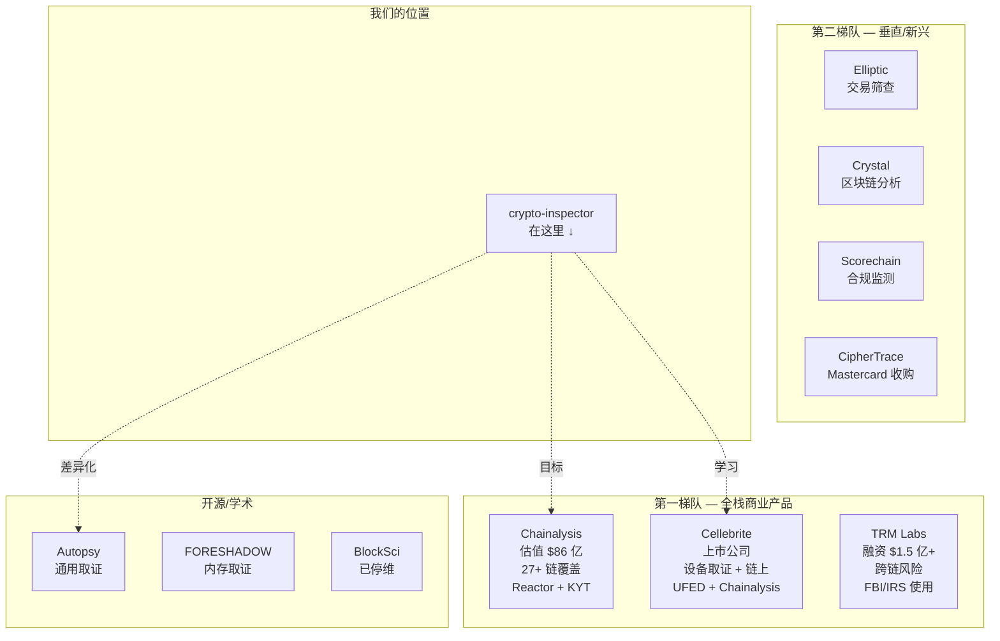
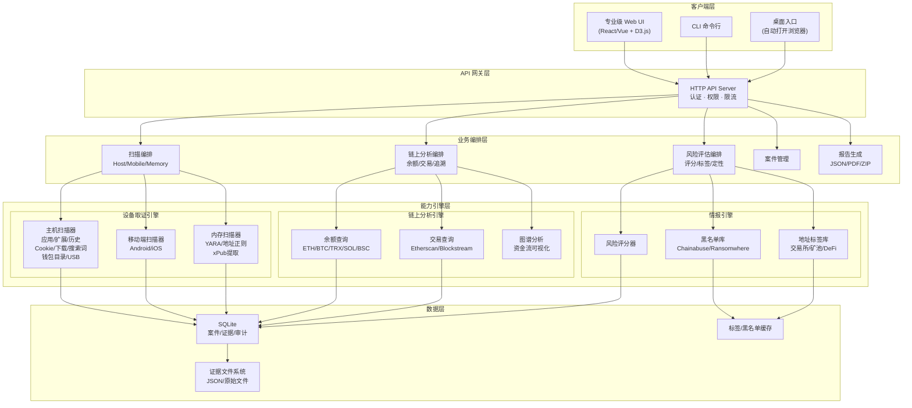

# 打造全球顶级数字货币取证产品 — 战略差距全景分析

> **视角**：以顶级产品架构师和公司负责人的角度，对标行业商业领导者（Chainalysis、Cellebrite、TRM Labs、Elliptic），结合 crypto-inspector 现有实现（9,328 行 Go 代码），全面剖析差距并给出产品升级路线。

---

## 一、行业格局认知

### 1.1 这个市场有多大

| 指标 | 数据 |
|------|------|
| 2024 年全球加密调查工具市场规模 | **$1.69 亿美元** |
| 2025 年预估 | **$2.02 亿美元** |
| 2031 年预估 | **$5.33 亿美元** |
| 年复合增长率（CAGR） | **17.1%** |
| 前 5 名市占率 | **~45%** |
| 剩余 55% 市场 | 分散在中小厂商和新兴公司 |

> [!IMPORTANT]
> 这意味着"第二梯队"仍有约 **$2.9 亿美元（2031 年）** 的市场空间。如果 crypto-inspector 能做到足够专业和差异化，完全有机会切入。

### 1.2 竞品全景地图



### 1.3 行业顶级产品的能力矩阵

我把一个"全球顶级"数字货币取证产品必须具备的能力分为 **8 大能力域、41 项具体能力**。以下逐一对比 crypto-inspector 的现状：

---

## 二、八大能力域差距全景

### 能力域 1：设备端证据采集

| # | 能力项 | Chainalysis | Cellebrite | crypto-inspector | 差距评级 |
|---|--------|-------------|------------|------------------|----------|
| 1 | 已安装应用扫描 | — | ✅ | ✅ | 无差距 |
| 2 | 浏览器扩展检测 | — | ✅ | ✅ | 无差距 |
| 3 | 浏览器历史分析 | — | ✅ | ✅ | 无差距 |
| 4 | **浏览器 Cookie/会话** | — | ✅ | ❌ | 🔴 严重 |
| 5 | **浏览器下载记录** | — | ✅ | ❌ | 🔴 严重 |
| 6 | **浏览器书签** | — | ✅ | ❌ | 🟡 中等 |
| 7 | **搜索引擎查询提取** | — | ✅ | ❌ | 🔴 严重 |
| 8 | **浏览器缓存/快照** | — | ✅ | ❌ | 🟡 中等 |
| 9 | **已删除数据恢复** | — | ✅ | ❌ | 🔴 致命 |
| 10 | **钱包数据目录深度扫描** | — | ✅ | ❌ | 🔴 严重 |
| 11 | Android 应用扫描 | — | ✅ | ✅ (ADB) | 🟡 偏弱 |
| 12 | iOS 数据采集 | — | ✅ | ✅ (备份) | 🟡 偏弱 |
| 13 | **剪贴板/输入法历史** | — | ✅ | ❌ | 🟡 中等 |

**总结**：设备采集是 crypto-inspector 最强的部分，但与 Cellebrite 相比，在**浏览器深度取证**和**已删除数据恢复**方面差距显著。

---

### 能力域 2：内存与进程取证

| # | 能力项 | FORESHADOW | Cellebrite | crypto-inspector | 差距评级 |
|---|--------|------------|------------|------------------|----------|
| 14 | **内存转储加载/分析** | ✅ | ✅ | ❌ | 🔴 致命 |
| 15 | **硬件钱包痕迹提取** | ✅ | ✅ | ❌ | 🔴 致命 |
| 16 | **xPub/公钥提取** | ✅ | — | ❌ | 🔴 严重 |
| 17 | **运行进程检测** | — | ✅ | ❌ | 🟡 中等 |
| 18 | **USB 设备连接历史** | — | ✅ | ❌ | 🔴 严重 |

**总结**：这是 crypto-inspector 最大的能力空白。硬件钱包（Ledger/Trezor）是高净值用户标配，无法检测意味着**遗漏最重要的目标群体**。

---

### 能力域 3：链上分析与追溯

| # | 能力项 | Chainalysis | TRM Labs | crypto-inspector | 差距评级 |
|---|--------|-------------|----------|------------------|----------|
| 19 | 链上余额查询 | ✅ | ✅ | ✅ (ETH/ERC20/BTC) | 🟡 链覆盖不足 |
| 20 | **多链覆盖 (27+ 链)** | ✅ | ✅ | ❌ (仅 3 链) | 🔴 严重 |
| 21 | **交易追溯/资金流** | ✅ | ✅ | ❌ | 🔴 致命 |
| 22 | **实体归属/去匿名化** | ✅ | ✅ | ❌ | 🔴 致命 |
| 23 | **混币器/跨链桥穿透** | ✅ | ✅ | ❌ | 🔴 严重 |
| 24 | **风险评分** | ✅ | ✅ | ❌ | 🔴 严重 |
| 25 | **地址聚类** | ✅ | ✅ | ❌ | 🟡 中等 |

**总结**：链上分析是 Chainalysis/TRM 的核心壁垒。crypto-inspector 已有余额查询是很好的起点，但**交易追溯**和**风险评分**是行业刚需。

---

### 能力域 4：情报与知识库

| # | 能力项 | Chainalysis | Elliptic | crypto-inspector | 差距评级 |
|---|--------|-------------|----------|------------------|----------|
| 26 | **恶意地址黑名单** | ✅ | ✅ | ❌ | 🔴 严重 |
| 27 | **交易所/服务商标签** | ✅ | ✅ | ❌ | 🔴 严重 |
| 28 | **制裁名单比对** | ✅ | ✅ | ❌ | 🟡 中等 |
| 29 | **暗网市场地址** | ✅ | ✅ | ❌ | 🟡 中等 |
| 30 | **勒索软件地址** | ✅ | ✅ | ❌ | 🟡 中等 |

**总结**：情报能力是商业产品的核心付费价值。可通过接入开源数据库（Chainabuse、Bitcoinabuse、Ransomwhere）快速补齐基础能力。

---

### 能力域 5：证据管理与法律合规

| # | 能力项 | Cellebrite | Autopsy | crypto-inspector | 差距评级 |
|---|--------|------------|---------|------------------|----------|
| 31 | 证据链完整性 | ✅ | ✅ | ✅ (chain_hash) | ✅ **领先** |
| 32 | 司法报告 PDF | ✅ | ✅ | ✅ | 无差距 |
| 33 | 打包导出 ZIP | ✅ | ✅ | ✅ | 无差距 |
| 34 | **多案件并行管理** | ✅ | ✅ | 🟡 基础版 | 🟡 中等 |
| 35 | **证据标签/注释** | ✅ | ✅ | ❌ | 🟡 中等 |
| 36 | **协作/权限管理** | ✅ | ✅ | ❌ | 🔴 严重 |
| 37 | **审计日志导出** | ✅ | ✅ | ✅ | 无差距 |

**总结**：证据管理是 crypto-inspector 的强项（chain_hash 设计甚至超越部分商业工具），但缺少**协作**和**标签**能力。

---

### 能力域 6：用户体验与界面

| # | 能力项 | Chainalysis | Cellebrite | crypto-inspector | 差距评级 |
|---|--------|-------------|------------|------------------|----------|
| 38 | **专业级 Web UI** | ✅ | ✅ | 🟡 基础版 | 🔴 严重 |
| 39 | **交易图谱可视化** | ✅ | ✅ | ❌ | 🔴 致命 |
| 40 | **时间线视图** | ✅ | ✅ | ❌ | 🔴 严重 |
| 41 | **仪表盘/数据概览** | ✅ | ✅ | ❌ | 🔴 严重 |

**总结**：当前 Web UI 是"能用"级别，距离"专业级"有明显差距。要让客户付费，UI 必须给人"这是一个价值几十万的工具"的感觉。

---

## 三、差距严重性汇总

### 按优先级排列的 Top 10 致命/严重差距

| 排名 | 差距 | 严重性 | 影响 | 补齐难度 | 建议优先级 |
|------|------|--------|------|----------|-----------|
| 1 | **无交易追溯/资金流可视化** | 致命 | 这是客户付费的第一核心需求 | 高（需接入多方 API） | 🔥 P0 |
| 2 | **无专业级 Web UI** | 致命 | 决定产品第一印象和客户转化 | 高（前端重构） | 🔥 P0 |
| 3 | **无地址风险评分** | 严重 | 无法对命中结果做定性判断 | 中（接入开源 API） | 🔥 P0 |
| 4 | **无 Cookie/会话分析** | 严重 | 错过交易所登录态这一关键证据 | 低（扩展现有 scanner） | 🔥 P0 |
| 5 | **无内存取证** | 致命 | 无法检测硬件钱包——高净值目标 | 高（新模块开发） | P1 |
| 6 | **无 USB 设备历史** | 严重 | 无法关联硬件钱包物理设备 | 中（系统日志解析） | P1 |
| 7 | **无已删除数据恢复** | 严重 | 对抗反取证手段的能力为零 | 高（SQLite WAL 解析） | P1 |
| 8 | **多链覆盖不足** | 严重 | 仅 ETH/BTC，缺 TRX/SOL/BSC | 中（扩展 chainbalance） | P1 |
| 9 | **无交易所/服务商标签库** | 严重 | 命中地址无法关联已知实体 | 中（构建标签数据库） | P1 |
| 10 | **无协作/权限管理** | 严重 | 无法支持团队作业（企业级需求） | 中（用户系统开发） | P2 |

---

## 四、如果我是公司负责人，我会怎么做

### 4.1 产品定位重新定义

```
┌─────── 当前定位 ──────────────────────────────────────┐
│  "数字币痕迹检测工具"                                   │
│   · 扫描设备上是否有钱包/交易所痕迹                      │
│   · 单点功能，工具属性                                   │
└─────────────────────────────────────────────────────────┘
                          ↓ 升级为 ↓
┌─────── 目标定位 ──────────────────────────────────────┐
│  "一站式数字资产调查平台"                                │
│   · 设备取证：全面采集数字货币相关痕迹                    │
│   · 链上追溯：从地址到资金流再到实体归属                  │
│   · 风险定性：恶意地址/制裁/暗网/勒索标签                 │
│   · 证据闭环：法律合规的证据链和报告体系                  │
│   · 对标口号："中国版 Chainalysis + Cellebrite 结合体"   │
└─────────────────────────────────────────────────────────┘
```

### 4.2 差异化竞争策略

> [!IMPORTANT]
> **核心策略：不与 Chainalysis 在链上分析深度硬碰硬，而是做"设备取证 + 链上分析"的融合型产品——这是全球没有任何一家商业公司做好的领域。**

| 竞品 | 强项 | 弱点 | crypto-inspector 的机会 |
|------|------|------|-------------------------|
| Chainalysis | 链上分析无人能敌 | **不做设备取证** | 设备端证据 → 自动追溯链上 |
| Cellebrite | 设备取证最强 | 链上分析**依赖外部**（买 Chainalysis） | 一体化，不需要两套工具 |
| TRM Labs | 跨链风险评估 | **不做设备取证** | 设备采集 + 风险评估一体 |
| Autopsy | 通用取证最全面 | **完全不懂数字货币** | 聚焦数字币的专业版 Autopsy |

**一句话差异化：** "从嫌疑人的电脑/手机里，一键发现他用过哪些钱包和交易所，自动追溯他的每一笔链上交易，标记每个地址的风险等级，生成法庭可用的完整证据包——别人需要买三套工具，我们一套搞定。"

### 4.3 目标客户画像

| 客户群 | 需求 | 支付能力 | 优先级 |
|--------|------|----------|--------|
| **公安/经侦** | 电信诈骗、传销、洗钱案件中追踪数字币 | 高（政府采购） | 🔥 首选 |
| **检察院/法院** | 需要法律合规的证据包 | 高 | 🔥 首选 |
| **金融监管** | 合规审计、风险排查 | 高 | 重要 |
| **企业安全/内审** | 员工设备合规检查 | 中 | 补充 |
| **律所/会计师事务所** | 民事纠纷中的数字资产调查 | 中 | 补充 |

---

## 五、产品路线图（我作为负责人的执行计划）

### Phase 0：紧急打磨（2 周）— "让现有功能可演示"

**目标：在 2 周内把产品做到可以给客户演示的状态**

| 任务 | 说明 | 天数 |
|------|------|------|
| Web UI 重构 | 从"能用"升级到"专业级"：深色主题、数据可视化卡片、响应式布局、动画过渡 | 5 天 |
| 仪表盘页面 | 案件概览 Dashboard：扫描统计、命中分布饼图、近期活动时间线 | 2 天 |
| 扫描结果优化 | 命中结果卡片化展示，带钱包/交易所 Logo、置信度色条、一键跳转 | 2 天 |
| 报告预览 | Web UI 内嵌 PDF 预览，一键下载 | 1 天 |

> [!TIP]
> **Phase 0 的核心指标**：能在客户面前做一次流畅的 15 分钟 Demo，客户看完觉得"这是一个专业产品"。

---

### Phase 1：核心能力补齐（6 周）— "做到行业门槛"

#### 1A. 浏览器深度取证增强（2 周）

| 功能 | 技术方案 | 代码位置 |
|------|----------|----------|
| Cookie/会话分析 | 解析 Chrome Cookies 数据库（AES-GCM 解密），匹配交易所域名，检测登录态 | `internal/adapters/host/browser_cookies.go` [NEW] |
| 搜索引擎查询提取 | 从浏览历史 URL 中提取 Google/Baidu/Bing 的搜索关键词 | 扩展 `host/scanner.go` |
| 下载记录分析 | 解析 Chrome History 的 downloads 表，检测钱包安装包/密钥文件 | 扩展 `host/scanner.go` |
| 书签分析 | 解析 Bookmarks JSON 文件，匹配交易所/钱包官网 | 扩展 `host/scanner.go` |
| 钱包数据目录扫描 | 扫描 `~/.bitcoin/` `~/.ethereum/` `~/Library/Application Support/Ledger Live/` 等已知路径 | `internal/adapters/host/wallet_dirs.go` [NEW] |

#### 1B. 链上追溯基础版（2 周）

| 功能 | 技术方案 | 代码位置 |
|------|----------|----------|
| 地址交易历史查询 | 接入 Blockstream API (BTC) + Etherscan API (ETH) + Tronscan API (TRX)，获取地址的完整交易列表 | `internal/services/chainquery/` [NEW] |
| 交易图谱可视化 | 前端实现交易流向图（使用 D3.js/Cytoscape.js），从一个地址展开上下游交易 | `ui/assets/graph.js` [NEW] |
| 多链余额扩展 | chainbalance 增加 TRX (Tron)、BSC (BNB Chain)、SOL (Solana) 支持 | 扩展 `chainbalance/` |

#### 1C. 地址风险评估（2 周）

| 功能 | 技术方案 | 代码位置 |
|------|----------|----------|
| 恶意地址黑名单 | 接入 Chainabuse API（免费）+ 内置 Bitcoinabuse/Ransomwhere 离线数据库 | `internal/adapters/intel/` [NEW] |
| 风险评分引擎 | 0-100 风险分：黑名单命中、交易所关联、混币器接触、暗网标记等维度加权 | `internal/services/riskscore/` [NEW] |
| 地址标签库 | 内置已知交易所/矿池/DeFi 协议的地址标签（公开数据源编纂） | `data/labels/` [NEW] |
| 风险报告卡 | 对每个命中地址生成"风险画像卡"：余额、交易次数、风险分、相关标签 | 扩展 `webapp/api.go` |

---

### Phase 2：高级取证能力（8 周）— "拉开差距"

#### 2A. USB/硬件钱包检测（3 周）

| 功能 | 技术方案 |
|------|----------|
| USB 连接历史解析 | **Windows**：解析注册表 `HKLM\SYSTEM\...\Enum\USB`；**macOS**：解析 `system.log` / `IORegistry` |
| Ledger/Trezor 设备识别 | USB Vendor ID 匹配：Ledger=2C97, Trezor=534C, KeepKey=2B24 |
| 钱包客户端进程检测 | 扫描当前运行进程列表，匹配 Ledger Live / Trezor Suite / Exodus 等进程名 |
| 系统事件日志分析 | Windows Event Log / macOS Unified Log 中的 USB 插拔事件 |

#### 2B. 内存取证模块（3 周）

| 功能 | 技术方案 |
|------|----------|
| 内存转储导入 | 支持 `.raw`/`.vmem`/`.dmp`/`.lime` 格式加载 |
| YARA 规则扫描 | 使用 `go-yara` 库，编写 Ledger/Trezor/MetaMask/Exodus 的内存签名 |
| 钱包数据提取 | 从内存中提取 xPub、交易记录、API 密钥等敏感数据 |
| 地址正则全扫 | 在内存空间中搜索 BTC/ETH/TRX 等地址正则，自动收集所有出现的地址 |

#### 2C. 已删除数据恢复（2 周）

| 功能 | 技术方案 |
|------|----------|
| SQLite WAL 解析 | 解析浏览器 WAL (Write-Ahead Log) 文件，恢复已删除的浏览历史 |
| 文件回收站扫描 | Windows 回收站 / macOS Trash 中的钱包文件 |
| 临时文件/缓存 | 扫描 `/tmp`、浏览器缓存目录中的价格查询/交易页面缓存 |

---

### Phase 3：企业级能力（8 周）— "可以卖钱"

| 功能 | 说明 |
|------|------|
| **多用户协作** | 用户账户、角色权限（管理员/调查员/审计员）、操作日志 |
| **案件管理增强** | 案件分配、状态流转（待调查→调查中→已结案）、优先级标签 |
| **证据标签/注释** | 调查人员可对任意命中/证据添加标签和备注 |
| **批量设备扫描** | 支持同时扫描多台设备，队列管理 |
| **定时/增量扫描** | 对已关注设备做定期增量扫描 |
| **API 开放平台** | 提供 REST API 让第三方系统（OA/案管系统）集成 |
| **数据导出与对接** | 支持与公安、检察院等部门的案管系统数据对接 |
| **部署安全** | HTTPS、身份认证、审计日志加密存储 |

---

## 六、技术架构升级总览

### 目标架构



---

## 七、投入预估与优先级建议

### 如果只有 1 个开发者（现实情况）

| 阶段 | 耗时 | 每周关键产出 | 里程碑 |
|------|------|-------------|--------|
| **Phase 0** | 2 周 | W1: UI 重构 + Dashboard；W2: 结果卡片 + 报告预览 | ✅ 可演示产品 |
| **Phase 1** | 6 周 | W3-4: 浏览器深度取证；W5-6: 链上交易查询 + 图谱；W7-8: 风险评分 | ✅ 行业门槛产品 |
| **Phase 2** | 8 周 | W9-11: USB/硬件钱包；W12-14: 内存取证；W15-16: 删除恢复 | ✅ 差异化产品 |
| **Phase 3** | 8 周 | W17-20: 多用户协作；W21-24: 企业级功能 | ✅ 商业化产品 |
| **总计** | **~24 周（6 个月）** | | **全球竞争力产品** |

### 如果有 3 个开发者（理想情况）

| 人员 | 负责方向 | 并行工作 |
|------|----------|----------|
| 开发者 A | 后端核心引擎（取证 + 链上） | Phase 1A + 2A + 2B |
| 开发者 B | 前端 + UI + 可视化 | Phase 0 + 交易图谱 + Dashboard |
| 开发者 C | 情报引擎 + 企业级 | Phase 1C + Phase 3 |
| **总耗时** | **~12 周（3 个月）** | |

---

## 八、最终总结

### 用一页纸回答"还差什么"

```
┌────────────────────────────────────────────────────────────────┐
│                    我们已经有的 (66%)                           │
│  ✅ 设备采集: 应用/扩展/历史 (三平台)                           │
│  ✅ 规则引擎: 钱包/交易所匹配                                   │
│  ✅ 链上查询: ETH/ERC20/BTC 余额                               │
│  ✅ 证据链: SHA256 + chain_hash                                │
│  ✅ 报告导出: JSON/PDF/ZIP 司法包                               │
│  ✅ Web API: 29 个端点                                         │
│  ✅ Web UI: 基础版单页应用                                      │
│  ✅ CLI + 桌面入口                                              │
├────────────────────────────────────────────────────────────────┤
│                    最急需补齐的 (20%)                           │
│  ❌ 浏览器深度: Cookie/下载/搜索词/书签/缓存                    │
│  ❌ 链上追溯: 交易历史 + 资金流可视化                            │
│  ❌ 风险评分: 黑名单 + 标签 + 评分引擎                          │
│  ❌ 专业 UI: 仪表盘/卡片/图谱/时间线                            │
├────────────────────────────────────────────────────────────────┤
│                    建立壁垒的 (14%)                             │
│  ❌ 内存取证: 硬件钱包数据提取                                   │
│  ❌ USB/设备历史: Ledger/Trezor 连接记录                        │
│  ❌ 已删除恢复: WAL 解析/回收站/缓存                             │
│  ❌ 钱包目录深度扫描: ~/.bitcoin/ 等                             │
│  ❌ 多链覆盖: TRX/SOL/BSC/ADA                                  │
└────────────────────────────────────────────────────────────────┘
```

> [!CAUTION]
> **如果只做一件事，做"链上交易追溯 + 资金流可视化"。这是客户付费的第一理由，也是目前与竞品差距最大的地方。**

> [!TIP]
> **如果做两件事，再加"专业级 Web UI 重构"。好的产品第一眼就要让客户觉得值钱。**

> [!NOTE]
> **好消息是：9,328 行高质量 Go 代码的后端基础已经非常扎实。架构设计干净（adapter/service/domain 分层清晰），扩展新能力的工程成本远低于从零开始。这个产品离"全球竞争力"大约还差 6 个月的专注开发——这在同类创业项目中已经是非常好的起点。**
